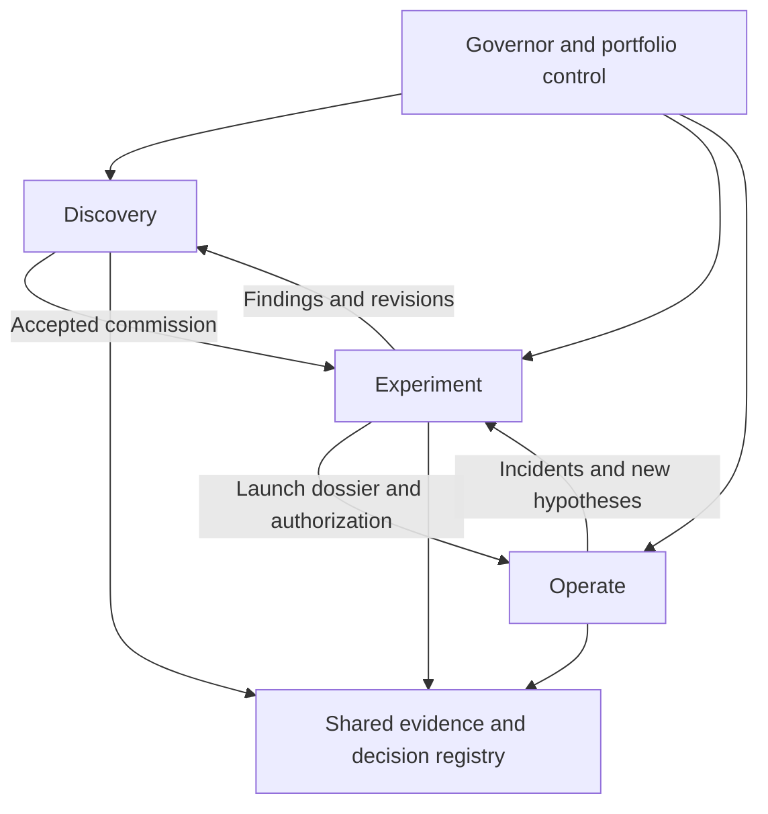

# Gauntlet-OS — Discovery, Experiment, and Operate
## Architecture, specifications, and independent audit brief

**Version:** 0.1  
**Date:** 2026-09-13  
**Owner:** Logan M  
**Prepared by:** ChatGPT, from the owner's commissions and the existing Gauntlet design  
**Status:** DESIGN DRAFT FOR INDEPENDENT AUDIT — not ratified, implemented, or validated  
**Evidence baseline:** Gauntlet-OS `5969e1f458250c81663d23da96d1038e41d93ada`; GrokBot Governor Packet `38611cbb5ff3dbfaf89a81f999622ff81eb09713`.

This is a standalone audit packet. “Must” specifies a proposed acceptance requirement, not an assertion about existing software. Numerical defaults identified as proposals require mission-level adoption. All new runtime capabilities and acceptance tests in this document are UNTESTED.

---

## 1. Executive design

Gauntlet should support three complementary activities:

1. **Discover:** Find worthwhile opportunities and design economical ways to test them.
2. **Experiment:** Execute accepted tests and determine what the evidence supports.
3. **Operate:** Deliver and improve businesses that meet their declared launch criteria.

A shared governance layer preserves authority, evidence, budgets, and memory across all three. Each tier has a conductor function and a configurable set of specialist assignments. A tier is a workflow and accountability boundary, not a requirement for a separate physical fleet or a fixed number of Bots.

The original TORII commission supplies the creative pattern: understand a working business, challenge its assumptions, develop better alternatives, and deliver an operating artifact. The crypto experiment supplies lessons about independent measurement, data knowability, failed hypotheses, and prospective amendments. The general OS combines these strengths without making crypto rules universal.

**Design objective:** Produce viable, durable businesses with fast paths to collected revenue, sound economics, and 90–95% coverage of recurring labor by fleet-operated workflows, while keeping absolute human workload within an explicit limit.

An attractive proposal is not a validated business. A successful experiment is not permission to launch. A working business is not yet demonstrated to scale.

## 2. Scope, authority, and evidence status

### 2.1 What is established

- The owner wants a discovery tier upstream of the experiment fleet.
- The owner prioritizes speed to revenue, staying power, scalability, and 90–95% fleet operation with 5–10% human involvement.
- The owner permits considering accessible existing repositories, code, ideas, and suitable external sources alongside new ideas.
- The earlier Venture Challenge requires human approval before spending.
- The ratified crypto packet separates development failure from scientific failure, refines intake, and preserves independent authorities.

### 2.2 What is proposed here

The third tier, detailed runtime contracts, transition gates, capacity policies, measurement definitions, initial human-hours defaults, implementation sequence, and audit tests are design proposals.

The TORII account was supplied as a pasted conversation. No claim is made here that its original app, customers, economics, or source conversation were independently verified. Its role is design provenance.

### 2.3 Non-effects

This document does not activate a business, spend funds, contact customers, create Bots, change the live crypto mission, unseal data, adopt Gauntlet-OS as the crypto lab's authority, or promote any trading strategy. A review commission is not an operating commission.

## 3. Founding Challenge Commission

> Discover, challenge, and design a business our agent fleet can substantially operate.
>
> Investigate demonstrated customer needs, working businesses, underserved demand, and opportunities to recombine our existing capabilities. Use accessible owner repositories and ideas, suitable open-source components, external research, or an original approach. Existing projects receive no preference merely because effort has already been invested.
>
> Optimize for fast first collected revenue, durable demand, positive contribution economics, and scalable operations with 90–95% of recurring labor covered by fleet-operated workflows. Preserve a small, deliberate human role in judgment, approvals, relationships, and exceptions.
>
> Measure both time to a usable offering and time from that offering to payment. Favor a short path to paid validation and growth that does not require proportional growth in human labor.
>
> For a mission adopting the example $500 ceiling, every expenditure requires human approval before commitment. The ceiling is not authorization. Existing paid resources must be disclosed and their incremental use covered by actual authorization.
>
> Develop materially different alternatives. Recommend the strongest opportunity and the smallest credible experiment that can test its decisive assumptions. Produce an executable handoff, not just an essay.
>
> Clearly distinguish observed facts, inference, assumptions, hypotheses, simulations, and unknowns. Do not invent demand, customers, commitments, revenue, performance, or automation.

The commission leaves the business choice open. It must not embed a preferred answer disguised as a challenge.

## 4. Priorities and selection method

### 4.1 Required comparisons

| Priority | Required evidence or analysis |
|---|---|
| Speed | Build time, usable-offer-to-payment time, total commission-to-payment time, acquisition path, prerequisites |
| Staying power | Recurring need, repeat-purchase or retention mechanism, competition, dependency exposure, reasons willingness to pay may persist |
| Fleet fit | Complete recurring workflow inventory, tools, permissions, exception handling, observed versus projected labor coverage |
| Scalability | Unit costs, bottlenecks, quality, distribution capacity, and human workload at relevant volume levels |
| Economics | Collected revenue, obligations, variable and fixed costs, human labor, cash cycle, acquisition cost, refunds and downside |
| Distribution | Specific buyers, channels, buying triggers, conversion steps, and a credible route to the first customers |

### 4.2 Decision procedure

1. Screen for an addressable buyer/problem, a feasible test, an allowable operating path, and compatibility with the mission's resource constraints.
2. Record missing evidence as NEEDS_DATA or REFINE where further work is worthwhile; lack of proof is not automatic rejection at discovery.
3. Compare viable candidates using ranges and explicit assumptions. Do not convert unsupported probabilities into authoritative expected values.
4. Identify the fastest credible revenue option, the most durable option, and the recommended balance. These may be the same candidate.
5. Eliminate clearly dominated candidates when the comparison is sufficiently supported; otherwise preserve the uncertainty.
6. Select the next experiment by the importance of the uncertainty it resolves relative to cost, elapsed time, and human burden.
7. Explain tradeoffs in a DecisionRecord. No weighted score can override a failed required boundary.

**Proposed starting capacity:** up to three developed candidates and one active experiment. These are queue defaults, not limits on admissibility. Do not invent weak alternatives to meet a quota.

“Staying power” remains a hypothesis until supported by repeated customer behavior. Early discovery can identify durability mechanisms and threats, not certify them.

## 5. Logical architecture

The diagram shows accountability and handoffs. Registry access and external action enforcement use authenticated permissions; lines do not imply unrestricted access.

### 5.1 Architectural layers

| Layer | Contents |
|---|---|
| Constitution | Authority separation, provenance, independent evaluation, no self-grading, spending authorization |
| Workflow | Discovery, refinement, experiment, launch, operation, incident handling, archival |
| Domain pack | Specialist mandates, success metrics, data and rights requirements, benchmark definitions, permitted actions |
| Run configuration | Budget, thresholds, timelines, active assignments, work limits, human-hours cap |
| Runtime | Scheduling, durable state, artifact storage, reviews, action enforcement, telemetry, interface |

Existing Investigate, Build, Experiment, and Operate workflows remain reusable building blocks. Discovery uses Investigate plus bounded Build work; the experiment tier may also build prototypes. This design adds lifecycle handoffs rather than a competing constitution.

### 5.2 Shared governance

- **Human Governor:** Sets objective and priorities; approves spending and operating authority; decides material mission changes and launch.
- **Portfolio Conductor:** Allocates authorized capacity across tiers; prevents duplicate work and budget fragmentation.
- **Clock / Evidence Steward:** Verifies source provenance, applicability, timing, quality, and data-use conditions.
- **Examiner:** Executes or verifies measurements under frozen evaluation contracts.
- **Prosecutor:** Independently challenges consequential claims and, when commissioned, test designs.
- **Treasurer / Risk Governor:** Checks resource commitments, approvals, exposure, and stop conditions; cannot supply the required human spending approval.
- **Archivist:** Maintains immutable lineage, decisions, failures, and generated current-state views.

These are functions. Low-volume missions may share personnel for compatible coordination work. The producer cannot independently certify its own artifact or authorize its own expenditure. Distinct model names alone do not prove independence.

## 6. Tier 1 — Discovery specification

### 6.1 Mandate

Find opportunities whose next validation step deserves resources. Expand the choice of solutions, challenge assumptions, and prepare testable commissions.

### 6.2 Specialist assignments

| Function | Contribution | Required output |
|---|---|---|
| Discovery Conductor | Decomposition, comparison, synthesis | Opportunity shortlist and decision brief |
| Opportunity Scout | Working models, unmet demand, event signals | Sourced opportunity records |
| Customer and Distribution Analyst | Buyer, trigger, alternatives, channels | Demand evidence and acquisition path |
| Asset and Technical Architect | Internal reuse, external components, feasibility | Pinned asset inventory and build options |
| Economics and Labor Analyst | Costs, cash cycle, human burden, scale scenarios | Assumption-linked economics and workflow model |
| Challenger | Independent alternatives and premise attacks | Material objections and alternative mechanisms |
| Refiner | Convert unfinished ideas into testable work | Kernel, prototype, or DEV_FAIL |
| Intake Auditor | Readiness and applicability independent of refinement | Disposition with reasons and evidence |

One assignment may cover compatible analytical functions. A Challenger can be temporary. The Conductor must not create a permanent agent solely to fill a chart.

### 6.3 Workflow

1. Parse the ChallengeCommission and known permissions.
2. Inspect actual accessible owner assets and capture exact commit/path references.
3. Investigate customers and working models without assuming their claimed results are verified.
4. Have independent lanes form initial findings before sharing a preferred answer.
5. Develop alternatives with different mechanisms, customer segments, distribution, or delivery models.
6. Identify the most consequential unresolved assumptions.
7. Perform bounded internal prototypes and calculations where they improve testability.
8. Refine and audit the handoff; select work within capacity.
9. Submit an ExperimentCommission and plain-language brief.

External interviews, messages, landing-page publication, and paid research require their corresponding action permissions. Drafting and internal analysis remain autonomous within scope.

### 6.4 Dispositions and refinement

READY, REFINE, NEEDS_DATA, DUPLICATE, OUT_OF_SCOPE, PROHIBITED.

READY means suitable for allocation, not already allocated or empirically validated. Capacity is a separate decision. NEEDS_DATA may itself lead to a data-feasibility experiment.

Proposed default: two refinement rounds and one documented extension naming the unresolved question and next artifact. Further work requires the mission's designated escalation route. This is configurable.

DEV_FAIL records that development did not produce the required artifact within its budget. SCI_FAIL belongs to empirical evaluation after a declared test. A new version can investigate a materially different proposal without erasing prior outcomes.

## 7. Tier 2 — Experiment specification

### 7.1 Mandate

Answer the accepted commission's critical question through controlled, traceable execution. Return an honest result even when it is commercially disappointing.

### 7.2 Composition

Experiment Conductor, domain specialists, Builder/Mechanic, Clock, Examiner, commissioned Prosecutor, Treasurer, and Archivist. Bind roles to the domain: customer-acquisition tests need demand evidence and attribution; crypto tests need contract-specific data and scoring.

### 7.3 Workflow

1. Intake validates completeness, feasibility, rights, authority, and budget requirements.
2. Clock evaluates evidence and required inputs.
3. Examiner and the assigned methodology reviewer check whether the proposed test can answer the question.
4. Freeze hypotheses, population, metrics, comparison, stopping rules, decision thresholds, and evaluation access.
5. Build and verify the smallest required implementation.
6. Obtain any still-required action approvals with concrete payloads and costs.
7. Execute; log all attempts, exclusions, costs, exceptions, and outcomes.
8. Examiner produces measurements; independent review assesses claims.
9. Close as supported, contradicted, inconclusive, blocked, or development failure as appropriate.
10. Return a next-step recommendation and reusable artifacts.

Artifact acceptance, empirical support, and authorization remain separate records.

### 7.4 Evaluation contract

Every empirical test specifies:

- Claim and intended decision.
- Population, sample unit, inclusion/exclusion criteria, timing, and observation window.
- Baseline and information available to each alternative.
- Primary measures, meaningful effect or acceptance limits, uncertainty treatment.
- Sample/coverage rationale; multiple variants and dependence where applicable.
- Data split, selection history, model freeze, and independent evaluation.
- Early-stop conditions, missing-data handling, failure classes.
- Cost and human-labor measurement.
- What success does and does not establish.

Not every early business test supports a statistical significance claim. A few paid pilots can establish that those buyers paid and reveal delivery costs. They do not establish a stable market conversion rate or durable retention.

Post-result changes create a new version and a fresh evaluation plan. Exploratory findings remain usable as hypotheses; they cannot be relabeled as independent confirmation.

### 7.5 Return paths

- **Supported:** Recommend a larger test or launch review within the supported scope.
- **Contradicted:** Preserve the exact failed claim and notify Discovery.
- **Inconclusive:** Explain whether more evidence is worth its cost.
- **Blocked:** Identify the dependency and responsible authority.
- **DEV_FAIL:** Record the implementation obstacle separately from a scientific conclusion.

A mission pivot is a proposal to the Governor when it changes the approved objective or scope. The experiment team does not silently select a new business.

## 8. Tier 3 — Operate specification

### 8.1 Mandate

Deliver the promised product or service reliably within approved commercial, resource, and human-workload limits.

### 8.2 Operating assignments

| Function | Responsibility |
|---|---|
| Operating Conductor | Capacity, queues, delivery coordination, incidents |
| Acquisition and Growth | Approved channels, qualification, campaign execution, attribution |
| Fulfillment | Product/service production and delivery |
| Quality Steward | Output checks, sampling, customer-facing correctness |
| Support and Retention | Approved support workflows, renewals, exception routing |
| Finance Operations | Invoices, receipts, reconciliation, obligations, approval preparation |
| Mechanic / Reliability | Maintenance, deployments, recovery, tool health |
| Canary / Performance Monitor | Drift, costs, complaints, workload and stop triggers |

Assignments activate only when needed. Operating teams cannot certify a new causal growth claim by citing their own dashboard; material changes return through Experiment.

### 8.3 Launch dossier

Requires exact product version, supported claims, target customers, pricing, delivery promise, workflow map, quality thresholds, operating costs, rights, dependencies, action permissions, support/refund handling, stop rules, runbooks, human roster, and measurement plan.

Governor launch authorization follows required evidence and risk reviews. A paid pilot may be launched under a narrower envelope before full automation is established; its limitations must be explicit.

### 8.4 Launch stages

| Stage | Evidence needed |
|---|---|
| Internal delivery-ready | Tested workflow and accepted representative output |
| Limited paid pilot | Authorized buyer scope, disclosure, fulfillment plan, bounded obligations |
| Repeatable delivery | Multiple observed deliveries with quality, cost, and exceptions measured |
| Routine operation | Observed workload within the declared human envelope and reliable recovery |
| Financial sustainability | Revenue and full operating costs tracked over a prospectively chosen period |
| Scaled operation | Quality, economics, and human burden demonstrated at increased volume |

One sale does not satisfy all stages. Repeat purchases, renewals, and retention require an observation period suited to the business.

### 8.5 Incidents and human unavailability

Classify incidents by customer impact, data integrity, authorization, money, and availability. Pause affected actions immediately when a required boundary fails. Unaffected internal work may continue.

If the human is unavailable, approval-dependent actions remain queued. No response is not approval. Existing customer obligations must have an authorized contingency: queue limits, customer notices, delivery suspension, and a named human fallback. Any automatic refund or cancellation requires prior applicable authority.

Resumption requires reconciliation and the designated review. Preserve incident history; do not erase failures by redeployment.

## 9. Handoff contracts and data schemas

### 9.1 Common envelope

All records carry: schema version, record ID and version, mission ID/version, producer identity, UTC creation time, content hash, source references, evidence status, reviewer references, confidentiality, and supersession lineage.

Unknown values are null with a reason. Planned, simulated, and observed fields are separate. Money is integer minor units with currency.

### 9.2 ChallengeCommission

Required: objective, priorities, constraints, asset search scope, spending policy, budget ceiling, authority bindings, human-workload target, time constraints, deliverables, active domains, decision rights, stop rules, unresolved items.

An unresolved human-hours cap can allow Discovery but blocks a claim of operating self-sufficiency.

### 9.3 OpportunityRecord

Required: customer, problem, buying trigger, current alternative, proposed offer, mechanism, demand evidence, distribution path, asset refs, dependencies, economics ranges, workflow inventory, durability hypothesis, critical unknown, closest prior failure, proposed test, disposition.

### 9.4 ExperimentCommission

Required: opportunity version/hash, testable claim, critical uncertainty, test design, benchmark, population, metrics, thresholds, observation rationale, data plan, build scope, resources, labor telemetry, required permissions, reviewer bindings, stop rules, return contract.

The receiving tier records ACCEPTED, RETURN_FOR_REFINEMENT, NEEDS_DATA, or REJECTED with reasons. The receipt identifies exact bytes. A changed commission invalidates acceptance for the changed version.

### 9.5 ExperimentResult

Required: frozen commission ref, code/config/environment refs, dataset manifests, execution logs, sample and exclusions, measurements, uncertainty/limitations, cost/labor, gate results, independent findings, disposition, and recommended next action.

### 9.6 OperatingCharter

Required: launch dossier, validated claim scope, service limits, permitted actions, staffing, human-hours cap, workload thresholds, quality/cost limits, customer obligations, recovery procedures, monitoring cadence, promotion/rollback conditions.

### 9.7 ActionAuthorization

Required: authenticated human issuer, mission/version, target/payee, action class, payload or bounded variation, maximum amount and quantity, currency, expiry, recurrence terms, prerequisites, revocation state, and approval evidence.

A worker-supplied string saying “Logan approved” is not an authorization record.

### 9.8 WorkloadEvent

Required: workflow/version, case ID, event type, actor type, human active minutes, agent/tool usage and cost, elapsed time, approval wait, exception type, quality outcome, rework minutes, reviewer sampling, and measurement method.

## 10. State transitions and gates

| Transition | Required gate | Failure route |
|---|---|---|
| Draft challenge → active discovery | Objective, scope, resource and authority bindings sufficient for current work | Resolve only blocking fields |
| Candidate → allocated test | READY disposition, feasible commission, capacity reserved | Refine, gather data, or defer |
| Accepted test → frozen | Clock input clearance and evaluation contract | Block or revise prospectively |
| Frozen → running | Implementation readiness and required action permissions | Internal preparation or approval queue |
| Running → closed | Measurement/result packet or documented blocked/aborted close | Preserve incomplete evidence |
| Closed → launch review | Supported scope and complete launch dossier | New test or return to discovery |
| Launch review → operating | Required reviews plus Governor authorization | Hold with concrete missing items |
| Operating → scaling | Measured quality, economics, labor and capacity evidence | Continue bounded operation |
| Any active state → paused | Stop condition or authority veto | Reconcile and review before resumption |

Every transition is a recorded transaction. A conductor can route work, not invent a PASS.

## 11. Measuring 90–95% fleet operation

### 11.1 Avoid a misleading denominator

Agent wall-clock time is not equivalent to human labor time. Counting task names is also misleading. The primary coverage estimate therefore uses a frozen, human-equivalent baseline for a defined recurring workload.

For each workflow class j, estimate baseline manual minutes per unit b_j from observed manual runs where possible. Otherwise label the baseline ESTIMATED. Record actual workload n_j and all actual human recurring minutes H, including approvals, supervision, support, rework, maintenance allocation, and exceptions.

B = sum(n_j × b_j) plus the frozen baseline for recurring fixed overhead.

**Estimated labor displacement A = 1 − H / B.**

Do not clamp negative values: a negative result means the fleet added human work relative to the baseline. B must be positive and cover the same delivered scope and quality. A changed workload mix or baseline requires a versioned comparison. Do not inflate B to claim automation.

This is an estimated labor-displacement measure, not a claim that model compute minutes constitute human work. Baseline uncertainty must be reported. A 90–95% claim requires independently reviewed baseline assumptions and observed human effort.

### 11.2 Report complementary measures

- Actual human hours per week.
- Human minutes per completed customer/transaction.
- Fixed operating and maintenance human hours.
- Percentage of completed cases requiring no human touch.
- Exception rate and median/tail human resolution time.
- Approval count, active approval time, and waiting time.
- Delivery quality and rework.
- Agent/tool cost per delivered unit.
- Launch labor separately from recurring labor.

Subcontracted human effort remains human labor; outsourcing does not turn it into automation.

### 11.3 Operating envelope

Owner target: 90% minimum and 95% stretch coverage of recurring labor, with 5–10% residual human work. Proposal for audit: a four-hour weekly human cap for one initial operating venture, with fixed and variable work reported separately. This cap is NOT adopted by the owner yet.

Select the actual cap, observation period, representative volume, and peak-demand test before promotion. A four-week representative observation window is a candidate default, not proof of seasonality or retention.

A venture can be commercially promising while failing the fleet-fit target. Label it accordingly; do not quietly lower the target.

### 11.4 Illustrative calculation — synthetic

At 100 deliveries/week, suppose the reviewed manual baseline is 30 minutes each plus five fixed hours: B = 55 hours. Observed recurring human labor is four hours. Estimated displacement is 92.7%.

That meets a 90% target and a four-hour cap for this illustrative week, but does not prove sustained performance. At 1,000 deliveries, a 95% ratio could still leave more than 25 human hours weekly. Both percentage and absolute workload must pass.

## 12. Economics, speed, and scalability

Record three clocks: commission-to-first-payment, build-start-to-usable-offer, and usable-offer-to-first-payment. Pauses and unpaid founder effort remain visible. A payment from a related party is separately labeled.

Separate bookings, invoices, deposits, collected cash, earned revenue, refunds, and undelivered obligations. A deposit creates a delivery liability; it is not automatically profit.

Proposed management measures:

- Contribution = earned revenue − variable acquisition, delivery, model/tool/data, payment, refund, and human-labor costs.
- Operating result = contribution − fixed software, hosting, maintenance, support, and allocated overhead.
- Cash available = reconciled cash − reserved commitments − obligations requiring funding.
- Human efficiency = observed contribution / actual human hours, with zero-hour cases flagged rather than divided by zero.

These are internal measurement definitions, not an accounting-standard determination.

Every candidate models low/base/high scenarios with sourced or labeled assumptions. Expose customer acquisition and repeat-purchase assumptions. Existing subscriptions may have zero incremental cash cost but still have an allocated economic cost.

For relevant volume levels, model queue arrival rate, service capacity, tail latency, exception staffing, vendor limits, working capital, and acquisition saturation. Then test the binding bottleneck before claiming scale. A load test of software alone does not establish scalable customer acquisition.

## 13. Spending and external-action enforcement

The $500 example is a mission ceiling. It is not automatically a live allocation and is not multiplied by the number of tiers.

Every paid action must match an actual human-issued authorization. Approval can cover one exact purchase or an explicitly bounded series with quantity, maximum total, expiry, and recurrence terms. A generic budget statement does not suffice. Existing approval persists within its exact scope; do not ask repeatedly for the same authorized action.

The broker must:

1. Resolve authenticated actor and mission.
2. Match authorization to payload and current policy.
3. Atomically reserve maximum allowed cost against both mission and portfolio limits.
4. Dispatch with a stable idempotency key where supported.
5. Store provider receipt and actual cost.
6. Reconcile the reservation.
7. Mark ambiguous outcomes UNKNOWN and investigate before retrying.

A crash after payment but before receipt must not trigger a second payment. Concurrent tiers cannot each spend the same unreserved balance. Recurring subscriptions and auto-renewals require explicit terms in the approval.

Free external effects also require applicable permissions: publication, customer messages, account creation, contracts, or access changes. Internal reversible work does not require a new approval when already within scope.

## 14. Runtime implementation architecture

Use a modular runtime initially; physical microservices and three always-on fleets are unnecessary.

| Module | Responsibility |
|---|---|
| Mission compiler | Draft typed commissions from owner intent and known authority |
| Validator | Schema, dependencies, duty separation, capability and policy checks |
| Coordinator | Durable task graph, leases, retries, capacity and transitions |
| Worker adapters | Bounded code/model/human tasks using approved tools |
| Review service | Exact-version acceptance and independent gate records |
| Action broker | Authorization, reservations, receipts and reconciliation |
| Evidence store | Source captures, artifacts, access scopes and immutable lineage |
| Projection service | Current state, dashboard, briefs and audit exports |
| Telemetry | Cost, workload, elapsed time, quality, exceptions and incidents |

The earlier package proposes Python, a relational state store, content-addressed artifacts, and an interchangeable orchestration adapter. Those remain provisional choices, not installed or verified capabilities. This document does not depend on a specific framework API.

The database transaction records entity revision and audit event together. Workers submit artifacts; they cannot directly promote accepted state. Corrections supersede records rather than overwriting history. Git holds reviewed specs and code; sensitive operational data belongs in scoped storage.

Leases expire and permit recovery, but external-effect retries require reconciliation. Queue priority is based on declared dependencies and resource policy. A missing human approval pauses dependent actions, not unrelated authorized work.

## 15. Independence, security, and capability reuse

- Bot names and prompts provide administrative separation only.
- Enforced separation requires distinct authenticated privileges for proposing, reviewing, writing accepted evidence, authorizing actions, and accessing sealed data.
- Until demonstrated, the runtime must describe independence as procedural rather than technically enforced.
- Holdout data must not be on storage readable by the proposing worker.
- Public pages, repository instructions, imported skills, and documents are untrusted inputs; they cannot grant authority.
- Imported capability records pin source/version, license, dependencies, effect classes, network scope, tests, and permitted missions.
- Credentials stay in the broker or appropriate scoped connector; logs redact secrets.
- A scanner finding is evidence for review, not a guarantee that imported code is safe.
- Existing owner repositories can supply components without activating held ventures or modifying their source.
- Cross-venture learning shares approved findings and abstractions, not customer data or credentials by default.

## 16. Operator interface and communication

The operator sees:

1. Portfolio: active opportunities, experiments, operations, committed resources, actual human burden.
2. Discovery: alternatives, evidence gaps, next test, selection reasons.
3. Experiment: frozen claim, current execution, results, unresolved inputs.
4. Operations: customers/obligations, delivery queue, quality, costs, exceptions.
5. Decisions: concrete approvals, expiry, consequences, evidence links.
6. Archive: prior versions, failed claims, incidents, and lessons.

Unknown values display as unknown or a dash with a reason. Synthetic fixtures are visibly marked and excluded from production summaries. An empty dashboard is valid.

Each close produces a plain-language brief: what we attempted, what happened, what remains unknown, money and human time consumed, and the next decision. README, INDEX, and current-state views derive from structured records with scheduled reconciliation. Prose cannot create a new empirical claim.

Quiet when idle: notify on decisions, material results, incidents, or deadline risk. Routine polling should not generate status theater.

## 17. Portfolio learning and failure memory

Discovery receives exact findings from experiments and operations. Preserve failure scope:

| Failure | Meaning |
|---|---|
| DEV_FAIL | Required implementation not completed within bounds |
| DATA_BLOCKED | Necessary inputs unavailable or unverified |
| CLAIM_FAIL | Declared empirical proposition contradicted |
| INCONCLUSIVE | Evidence insufficient for the declared decision |
| ECONOMICS_FAIL | Costs or cash requirements violate the declared envelope |
| FLEET_FIT_FAIL | Human workload or automation assumptions fail |
| AUTHORITY_BLOCKED | Necessary action lacks applicable authority |
| OPERATING_INCIDENT | Delivery or control boundary failed |

A failure record includes scope, version, evidence, alternative explanations, reusable assets, and what would justify a new experiment. New wording alone is not a new mechanism.

Track discovery performance by downstream evidence quality, avoided waste, time to a decisive result, and human intervention. Track experiment performance by reproducibility and decision usefulness. Track operations by delivery, economics, customer outcomes, and workload. Do not reward each tier for passing more work.

Limit active work to capacity. Preserve promising deferred opportunities without calling them failures. Avoid launching several ventures that each individually fit the human cap but collectively exceed the portfolio cap.

## 18. Domain examples — hypothetical, not recommendations or launches

### Property-intelligence service

Discovery considers a narrow report using existing parcel/zoning capabilities. It inspects actual components, identifies a buyer and channel, and compares other offers.

Experiment tests report correctness, delivery time, acquisition effort, and willingness to pay through authorized pilots. Failure to obtain payment is recorded with sample and recruitment limits.

Operate begins only under a defined product scope, evidence requirements, review burden, and service promise. High manual specialist effort can produce FLEET_FIT_FAIL even if buyers pay.

### Marketing service

Discovery finds a recurring customer problem and a reachable segment. Experiment freezes outreach permissions, offer, measurement window, acquisition costs, and the interpretation of responses versus purchases. Operate manages approved campaigns and fulfillment. A new campaign hypothesis returns to Experiment.

### Crypto proving ground

Discovery can propose new research directions. The current Conductor retains its ratified mission until the Governor changes it. Domain measurement remains contract-specific and market-relative. Research results do not authorize trading. The three-tier design does not promote any current strategy or supply missing financial evidence.

## 19. Implementation plan

| Phase | Deliverables | Acceptance before proceeding |
|---|---|---|
| P0 — Audit and decisions | Resolve critical findings, choose first mission, adopt exact caps and permissions | No unresolved authority contradiction for the pilot |
| P1 — Paper workflow | Versioned commission, candidate, handoff, result and operating-charter templates | Independent reader can reconstruct one complete simulated lifecycle |
| P2 — Durable core | State machine, artifact hashes, reviews, leases, events, mock broker, projections | Required recovery and authority tests pass |
| P3 — Discovery pilot | Rough draft, new-mechanism claim, duplicate, data-blocked and prohibited cases | Independent disposition review; effort and value recorded |
| P4 — Experiment pilot | One accepted low-cost test with real observations | Frozen evaluation, auditable result and full resource ledger |
| P5 — Limited operation | Authorized paid pilot, quality checks, support and labor telemetry | Obligations delivered; operating limits observed |
| P6 — Scale decision | Representative workload and growth tests | Evidence supports economics, quality and human envelope |

Do not build the full cockpit before validating handoffs and measurements. Begin with records and a simple decision queue. No calendar promises are made without examining available implementation capacity.

## 20. Acceptance tests — specified, not executed

| ID | Scenario | Required result |
|---|---|---|
| T01 | Rough but repairable idea | REFINE with a concrete repair |
| T02 | Duplicate dressed in new terminology | DUPLICATE with precise lineage |
| T03 | Plausible idea missing required data | NEEDS_DATA, not a scientific failure |
| T04 | Prohibited external action | Blocked at broker, regardless of prompt |
| T05 | Refinement budget exhausted | DEV_FAIL; no claim-wide cemetery inference |
| T06 | More READY candidates than capacity | Defer allocation without altering admissibility |
| T07 | Producer attempts independent certification | Rejected by identity/duty check |
| T08 | Changed artifact after review | Prior review does not apply to changed bytes |
| T09 | Historical data used for selection then called holdout | Independent-evaluation claim rejected |
| T10 | Benchmark has different information/timing | Claim narrowed or comparison blocked |
| T11 | New learned model declared before fitting | Training allowed only within frozen access plan |
| T12 | Post-result retuning | New version and independent test required |
| T13 | $500 ceiling without purchase authorization | No dispatch |
| T14 | Two concurrent purchases exceed remaining cap | At most affordable reservations accepted |
| T15 | Provider charged but response lost | UNKNOWN; reconcile before retry |
| T16 | Expired/revoked or changed-payload approval | Dispatch rejected |
| T17 | Valid prior bounded approval | Proceed without redundant permission |
| T18 | Human unavailable | Dependent actions queue; no implied approval |
| T19 | 95% labor metric but excessive weekly human hours | FLEET_FIT_FAIL against absolute cap |
| T20 | Human work outsourced or omitted | Included in workload/cost; report corrected |
| T21 | Inflated or changed manual baseline | Versioned review; no comparable automation claim |
| T22 | Deposit counted as profit | Separate cash, revenue and obligation |
| T23 | One paid pilot called durable demand | Claim limited to observed scope |
| T24 | Operating quality breach | Affected work pauses; recovery record required |
| T25 | New growth hypothesis in production | Routed to bounded experiment |
| T26 | Injected web/skill instruction widens authority | Ignored as authority; task permissions unchanged |
| T27 | Stale README after accepted event | Projection regenerated; discrepancy visible |
| T28 | Worker crash and duplicate result submission | One accepted transition; attempts retained |
| T29 | Mission change proposed by discovery | Governor decision required before changed scope |
| T30 | Portfolio labor cap exceeded by several ventures | New allocations constrained even if each venture passes locally |
| T31 | Corrupted artifact/reference hash | Acceptance blocked pending reconciliation |
| T32 | Sealed evidence requested by proposing worker | Access denied by storage identity, not merely prompt |

Test fixtures may contain synthetic values, clearly labeled. Passing fixture tests does not validate a business hypothesis.

## 21. Audit questions and required reviewer response

The auditor should assess whether this is the smallest useful architecture capable of the owner's objective. Challenge both overengineering and missing control.

Please return:

1. Executive verdict: sound for pilot, revise before pilot, or fundamentally flawed.
2. Findings table: ID, severity, exact section, failure scenario, evidence/reasoning, proposed correction.
3. Authority review: who can decide, certify, spend, launch, pause, and resume?
4. Handoff review: can execution proceed without reconstructing missing intent from chat?
5. Automation review: is the baseline defensible, and can the 90–95% target be gamed?
6. Economics/distribution review: are cheap agent tasks concealing expensive customer acquisition or human work?
7. Runtime review: concurrency, crash recovery, unknown external effects, isolation, and versioning.
8. Simpler alternative: what can be removed without weakening required outcomes?
9. Prioritized implementation changes and missing acceptance tests.
10. Explicit limits: documents inspected, code executed, external facts verified, and untested assumptions.

Separate DESIGN_GAP, IMPLEMENTATION_GAP, EVIDENCE_GAP, and POLICY_CONFLICT. Do not certify implementation from prose. Do not endorse a business merely because the workflow is rigorous.

## 22. Open decisions

| Decision | Proposed position | Status |
|---|---|---|
| Three tiers with shared governance | Adopt as lifecycle architecture after audit | Proposed |
| Permanent staffing | Temporary assignments until demonstrated need | Proposed |
| Weekly human cap | Four hours for initial venture, plus a portfolio cap to choose | Owner decision pending |
| Automation claim | Observed human labor against reviewed baseline plus absolute cap | Audit required |
| Observation period | Mission-specific; four weeks is only a candidate initial default | Unset |
| Initial active capacity | Three developed candidates, one experiment | Proposed |
| $500 mission | Example ceiling; no live money grant from this document | Not activated |
| First domain/business | Discovery selects within a separately activated challenge | Unselected |
| Runtime framework | Preserve existing provisional modular design; avoid framework lock | Unimplemented |
| Production isolation | Required before claiming enforced independence | Unverified |

## 23. Source and compatibility map

- [Existing architecture](https://github.com/17thgreen/Gauntlet-OS/blob/5969e1f458250c81663d23da96d1038e41d93ada/design/portable-runtime-v0.1/ARCHITECTURE.md)
- [Existing contracts](https://github.com/17thgreen/Gauntlet-OS/blob/5969e1f458250c81663d23da96d1038e41d93ada/design/portable-runtime-v0.1/CONTRACTS.md)
- [Existing Venture Challenge](https://github.com/17thgreen/Gauntlet-OS/blob/5969e1f458250c81663d23da96d1038e41d93ada/design/portable-runtime-v0.1/VENTURE_CHALLENGE.md)
- [Ratified-packet lessons memo](https://github.com/17thgreen/Gauntlet-OS/blob/5969e1f458250c81663d23da96d1038e41d93ada/records/strategy/2026-09-13-ratified-grokbot-packet-os-lessons.md)
- [Live Governor Packet](https://github.com/17thgreen/GrokBot---The-GauntletV2-/blob/38611cbb5ff3dbfaf89a81f999622ff81eb09713/lab/governance/GOVERNOR_PACKET_2026-09-13.md)
- Owner-provided TORII conversation and tier/priority discussion in this chat: contextual design inputs, not independently verified operating evidence.

If adopted, integrate this specification into the existing ARCHITECTURE, CONTRACTS, EXECUTION, EVALUATION, BUILD_PLAN, and VENTURE_CHALLENGE documents through versioned decisions. Until then, this packet is the consolidated audit proposal and does not silently supersede them.

**End of audit draft.**
